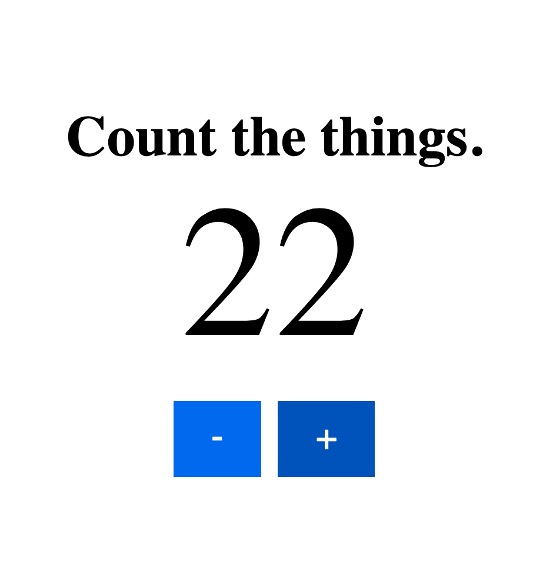

# count-the-things-multiplayer

A simple websocket app for multiple people to count things together. Created to track occupancy at a Farmer's Market with multiple entrances and exits.



For a "single player" variant, see the [static version](https://github.com/MustardForBreakfast/count-the-things) of this project.

## Local Environment Setup

```
npm install
npm run start
```
Then visit `http://localhost:8765` in your web browser of choice.

### Testing with Multiple Client Devices

I recommend using [ngrok](https://www.npmjs.com/package/ngrok) for this use case, which publicly exposes your local web server via a network tunnel:
``` bash
npm install ngrok -g
ngrok http 8765 # after starting the application
```
Your terminal should display a public URL for all client devices to connect to.

Given the ephemeral nature of `ngrok` urls, it is impractical to whitelist them in the app's Content Security Policy. While testing with `ngrok`, it may be necessary to temporarily disable the CSP by commenting out the `expressCspHeader` config in `app/index.js`.

*For obvious reasons, one should not leave the CSP disabled on a permanent production deployment.*